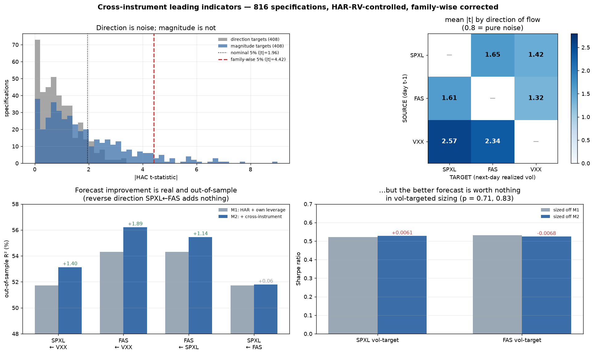

# Cross-instrument leading indicators

Does an aggregated feature of one instrument on day t−L carry information about another
instrument's move on day t, beyond what the target's own history already says?

`FINDINGS.md` §T2.4 tested this narrowly — 5-minute returns → returns at lags ±6 bars —
and found nothing above |0.014|. That test was wrong in two ways: it used only one
aggregation, and it only tried to predict **direction**. This document fixes both.

Scripts: `p11`–`p15`. Output: `../out/p11_*` … `p15_*`.

---

## Bottom line

| | Result |
|---|---|
| **Direction** (next-day return, overnight return) | **Nothing.** 0 of 408 specifications survive family-wise correction. |
| **Magnitude** (next-day realized vol) | **34 of 408 survive.** Family-wise p = 0.0000 against a bootstrap null. |
| Strongest signal | **VXX last-hour realized vol → SPXL/FAS next-day realized vol** |
| Direction of flow | **VXX → SPXL/FAS, and SPXL → FAS. The reverse (FAS → SPXL) is null (p = 0.13).** |
| Does it improve forecasts out of sample? | **Yes.** OOS R² +1.4 pp (SPXL), +1.9 pp (FAS). Diebold-Mariano p = 0.002, 0.004. |
| **Is it worth money?** | **No, in the two applications tested.** Vol-targeted sizing: +0.006 / −0.007 Sharpe (p = 0.71, 0.83). Big-move classification: no AUC gain, and *worse* for FAS. |

**The honest summary: a genuine, out-of-sample-validated cross-asset volatility signal
that I could not monetize.** Both halves of that sentence matter.

---

## 1. Design

**Aggregations tried:** last hour of the session (15:00–15:55), first hour, full session,
and 5-day windows — at lags of 1 and 2 days. The user's suggestion of "the hour before"
and "two days before" are both directly in the grid.

**Features (17 per source instrument):** window return, log realized volatility,
bipower-variation jump share, dollar-volume ratio, close-in-range, signed-volume
imbalance, last-hour share of daily variance, max absolute 5-min move, Amihud
illiquidity, 5-day return / logRV / volume ratio.

**Targets (4 per instrument):** close-to-close return and overnight return (*direction*);
absolute return and log realized volatility (*magnitude*).

**816 specifications** = 6 ordered pairs × 4 targets × 2 lags × 17 features.

### The two controls that make this honest

**Control 1 — HAR-RV.** Realized volatility is strongly autocorrelated, so "VXX vol today
predicts SPXL vol tomorrow" is trivially true and vacuous. Every magnitude regression
therefore controls for the *target's own* daily, weekly and monthly realized-volatility
components. Only the incremental contribution of the cross term is tested.

**Control 2 — the leverage effect.** This one nearly broke the study; see §3.

### Multiple testing

816 tests on autocorrelated data makes naive p-values meaningless. Three layers:
HAC (Newey-West) standard errors; Benjamini-Hochberg FDR; and a **circular-rotation
bootstrap** that rotates the cross-predictor relative to the target — destroying
cross-alignment while preserving each series' own autocorrelation exactly — to obtain the
null distribution of max|t| across all 816 tests simultaneously.

## 2. Scan results

| | count | expected by chance |
|---|---|---|
| nominal p < 0.05 | **186** of 816 | ~41 |
| nominal p < 0.01 | **117** | ~8 |
| BH-FDR q < 0.05 | 106 | — |
| exceed family-wise 95% critical value (\|t\| = 4.42) | **34** | ~0.05 expected |

Observed max|t| = **8.67**. The bootstrap null for max|t| has median 3.54, 95th percentile
4.42, and a maximum over 400 replications of 6.15. **Family-wise p = 0.0000.**

Split by target type:

| | nominal p<0.05 | BH q<0.10 | **FWER survivors** |
|---|---|---|---|
| direction (408 specs) | 40 (chance ~20) | 17 | **0** |
| magnitude (408 specs) | 146 (chance ~20) | 116 | **34** |

**Direction remains unpredictable** — the mild excess (40 vs 20) does not survive correction.
This is now the fourth independent way this analysis has reached that conclusion.

Mean |t| by direction of information flow (magnitude targets; 0.8 = pure noise):

| source ↓ / target → | SPXL | FAS | VXX |
|---|---|---|---|
| **SPXL** | — | 1.65 (6 FWER) | 1.42 (1) |
| **FAS** | 1.61 (1 FWER) | — | 1.32 (0) |
| **VXX** | **2.57 (13 FWER)** | **2.34 (13 FWER)** | — |

VXX leads both levered funds' volatility. SPXL leads FAS more than FAS leads SPXL.

## 3. The check that nearly killed it

The top raw finding was `VXX close-in-range → SPXL next-day logRV`, t = **8.85**.

VXX is −0.73 correlated with SPXL. "VXX closed near its high" ≈ "SPXL had a down day",
and down days predicting higher next-day volatility is the **leverage effect** — a
property of SPXL's *own* returns, not information from VXX. The HAR-RV control covers the
target's own *volatility* history but not its own *return*. So the headline finding could
have been the leverage effect wearing a costume.

Nested test — M0: HAR-RV. M1: + the target's own return, close-in-range and downside
return. M2: + the VXX terms:

| target ← source | R² M0 | R² M1 | R² M2 | incremental | joint Wald p |
|---|---|---|---|---|---|
| SPXL ← VXX | 55.06% | 57.73% | 58.86% | +1.13 pp | 6.2e-09 |
| FAS ← VXX | 55.79% | 57.25% | 59.29% | +2.04 pp | 1.7e-13 |
| FAS ← SPXL | 55.79% | 57.25% | 58.72% | +1.47 pp | 5.4e-11 |
| **SPXL ← FAS** | 55.06% | 57.73% | 57.93% | +0.19 pp | **0.126** |

The leverage effect is real and worth ~2.7 pp of R² on its own. And it **completely
absorbs one of the three cross terms**:

| VXX term → SPXL logRV | t vs HAR only | t vs HAR + own leverage |
|---|---|---|
| `VXX day_ret` | 7.16 | **0.35** ← was the leverage effect |
| `VXX day_cir` | 8.85 | **2.90** ← survives, much weaker |
| `VXX lasthr_logrv` | 6.66 | **4.28** ← survives strongly |

So the directional VXX features were a disguised leverage effect and are discarded. What
survives is **VXX's last-hour realized volatility** — a genuine volatility-of-volatility
signal, not a return proxy. That is a more specific and more believable claim than the raw
scan produced, and it is the one carried forward.

**FAS → SPXL is null** (p = 0.126) while **SPXL → FAS is strong** (p = 5.4e-11). That
asymmetry is exactly what liquidity predicts: SPXL trades $3.76M per 5-minute bar, FAS
$528K. Information flows from the liquid instrument to the thin one, not back.

## 4. Out-of-sample forecast evaluation

Expanding-window refits, 972 out-of-sample days (2022-08-23 → 2026-07-22):

| | OOS R² M1 | OOS R² M2 | gain | DM on MSE | DM on QLIKE |
|---|---|---|---|---|---|
| SPXL ← VXX | 51.73% | **53.13%** | +1.40 pp | t = −3.10, **p = 0.002** | p = 0.134 |
| FAS ← VXX | 54.31% | **56.20%** | +1.89 pp | t = −2.90, **p = 0.004** | p = 0.055 |
| FAS ← SPXL | 54.31% | 55.45% | +1.14 pp | t = −1.92, p = 0.055 | p = 0.055 |
| SPXL ← FAS | 51.73% | 51.79% | +0.06 pp | p = 0.704 | p = 0.112 (M1 better) |

The improvement is real, out-of-sample, and passes a Diebold-Mariano test on squared
error. On QLIKE — the loss that penalizes under-forecasting variance — it is weaker and
only marginal.

## 5. …and it is worth nothing economically

**A. Volatility targeting.** Scale a long position by 1/forecast-vol, 20% annualized
target, leverage capped at 3×:

| sizing | SPXL Sharpe | FAS Sharpe |
|---|---|---|
| constant 1× | 0.672 | 0.448 |
| vol-target off M0 (HAR) | 0.547 | 0.508 |
| vol-target off M1 (+ leverage) | 0.522 | **0.532** |
| vol-target off M2 (+ cross) | **0.528** | 0.525 |

M2 − M1: **+0.006 Sharpe on SPXL (p = 0.71), −0.007 on FAS (p = 0.83)**. Nothing. And M2
raises annual turnover (SPXL 27.0 → 28.6, FAS 15.8 → 17.7), so after costs it is *worse*.

Two further observations worth recording. Vol targeting *reduced* Sharpe for SPXL
(0.672 → 0.53) — this is a 3× fund whose volatility is already elevated, and de-levering
it in high-vol periods removed more return than risk. And every model delivered realized
volatility of 27–29% against a 20% target (`realized_vs_target` 1.33–1.44) — none of them
is well calibrated, so the marginal ranking between them is somewhat academic.

**B. Big-move-day classification.** Flagging tomorrow as a top-decile absolute-move day:

| | M0 AUC | M1 AUC | M2 AUC | M2 − M1 (bootstrap 95% CI) |
|---|---|---|---|---|
| SPXL top decile | **0.777** | 0.775 | 0.773 | −0.002 [−0.009, +0.006] |
| SPXL top 5% | 0.775 | 0.775 | **0.776** | +0.001 [−0.005, +0.007] |
| FAS top decile | **0.741** | 0.740 | 0.720 | **−0.020 [−0.038, −0.003]** |
| FAS top 5% | 0.770 | **0.774** | 0.768 | −0.006 [−0.027, +0.015] |

No gain anywhere, and for FAS's top decile M2 is **significantly worse**. Plain HAR (M0)
is the best classifier for three of the four cells.

The classification models are genuinely useful in absolute terms — AUC 0.72–0.78, with a
3.6–7.7× lift in the flagged bucket — but that comes from volatility persistence, which
M0 already captures. The cross-asset term adds nothing to it.

### Why the gap between statistical and economic significance

The incremental R² is 1–2 pp on a forecast that already explains ~52%. In vol targeting,
position size is proportional to 1/σ̂, so a 2% better variance forecast moves position size
about 1% — swamped by the noise in next-day returns. For tail classification, the linear
log-RV improvement sits in the middle of the distribution, not in the tail where the
events are. **A forecast can be reliably better and still be too small to trade.**

## 6. What this means

Reported as a finding about market structure rather than a strategy:

1. **VXX's last-hour realized volatility genuinely leads next-day realized volatility in
   both SPXL and FAS**, incremental to HAR-RV and to the leverage effect. Late-session
   volatility in the volatility complex carries information about tomorrow.
2. **Information flows SPXL → FAS, not FAS → SPXL** (p = 5.4e-11 versus p = 0.126). The
   liquid instrument leads the thin one.
3. **Nothing leads direction** at any aggregation from 5 minutes to 5 days.
4. Neither (1) nor (2) survives contact with a P&L statement in the two applications
   tested.

Where this signal *could* still pay, untested here because the data does not exist in this
repo: **options**. A 1–2 pp better variance forecast is worth far more when pricing a short
-dated option than when sizing a delta-one position, because the option's value is a direct
function of variance rather than a second-order input. There are no SPXL, FAS or VXX option
chains in this repository — only SOXL and TQQQ — so this is a hypothesis, not a result.

## 7. Limitations

- **Realized volatility is measured from 5-minute trade bars**, RTH only. Overnight
  variance is excluded from the target entirely, which understates true daily variance and
  may matter more for VXX than for the equity funds.
- **The 972-day out-of-sample window is one macro period** (late 2022 onward). The
  VXX→SPXL relationship could be regime-specific.
- **Two economic applications tested, not all of them.** Vol targeting and tail
  classification are the obvious uses for a delta-one book; they are not exhaustive.
- **The bootstrap null uses circular rotation**, which preserves autocorrelation exactly
  but assumes stationarity. With a 6-year window spanning a bear market, that is an
  approximation.
- 816 specifications is a large search. The family-wise correction is what makes the
  headline defensible, but the *specific* surviving features should be treated as one
  plausible representative set, not as uniquely identified.
