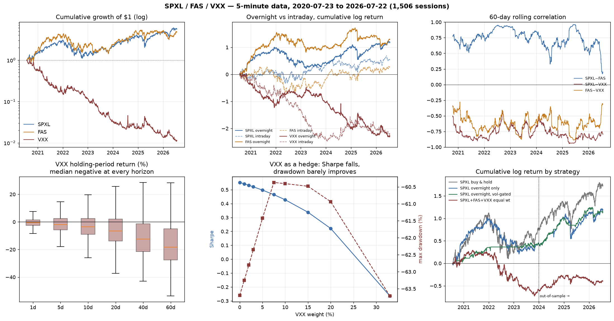

# ETF Group Analysis — Findings

**Instruments:** SPXL (3× S&P 500), FAS (3× Russell 1000 Financials), VXX (long front VIX futures ETN)
**Data:** 5-minute RTH bars, 2020-07-23 → 2026-07-22, 1,506 common sessions, ~117,000 bars each
**Plan:** `TEST_PLAN.md`, written before any test was run. Raw output: `../out/`.

> The request named `FAX_5min_6Years.csv`. **No such file exists in this repository.**
> This analysis uses `FAS_5min_6Years.csv` (Direxion 3× Financials). FAX is a real
> ticker (abrdn Asia-Pacific Income Fund, a bond CEF) — if that is what was meant, the
> data must be sourced and essentially every conclusion below re-derived.

---

## Bottom line

**1. This is not a basket. It is one bet plus a wasting asset.**
PC1 explains **80.5%** of daily variance and never drops below 75.6% in any rolling
year. SPXL and FAS are the same trade at different volatilities. VXX is the inverse of
that trade, minus 52%/year of carry.

**2. Nothing intraday is tradeable.** SPXL and FAS 5-minute returns are statistically
indistinguishable from random walks (variance-ratio |z| < 2 at every horizon). The best
of 32 intraday mean-reversion variants breaks even at **0.34 bp** per round trip — an
order of magnitude below any plausible cost. 30 of the 32 lose money gross, before costs.

**3. The one real, robust effect is the overnight/intraday split.** For SPXL, 68% of six
years of cumulative return accrued between the close and the next open; for FAS, 83%.
The overnight leg earns Sharpe 0.65 at 61% of the volatility of holding all day; the
intraday leg earns Sharpe 0.22 while carrying more volatility and a worse drawdown.

**4. VXX cannot be held and does not work as a hedge here.** Median return is negative at
every horizon from 1 to 60 days; hit rate falls from 40% (1 day) to 20% (60 days).
Adding *any* VXX weight to a long book monotonically reduced Sharpe, and — the finding
that matters — **barely changed maximum drawdown at all** (−63.7% at 0% VXX, −60.4% at
10%, −63.7% at 33%). It cuts daily volatility, not the drawdown you actually care about.

**5. The apparent star strategy did not survive its own audit.** A volatility-gated
overnight sleeve showed Sharpe 1.14. Under a clean protocol — select on train, evaluate
on test — the rank correlation between train and test Sharpe across the 22 gate variants
is **−0.04**. Gate selection carries no information. That strategy is dropped below.

**Recommended holding period: overnight (roughly 17.5 hours), not intraday.** If the
answer must be a single position, it is SPXL, not the trio.

---

## Phase 0 — Data integrity (all pass)

| | SPXL | FAS | VXX |
|---|---|---|---|
| Bars / sessions | 117,012 / 1,506 | 117,036 / 1,506 | 117,270 / 1,509 |
| Range | 2020-07-23 → 2026-07-22 | same | → 2026-07-27 |
| Duplicate stamps | 0 | 0 | 0 |
| OHLC violations | 0 | 0 | 0 |
| Non-positive prices | 0 | 0 | 0 |
| Zero-volume bars | 22 | **348** | 3 |
| Split discontinuities | **0** | **0** | **0** |

**All three are back-adjusted and continuous.** Every overnight ratio sits inside
[0.86, 1.45] — no split jumps anywhere. This matters: VXX runs $1,925.76 → $22.22, a
98.85% decline, and it is genuine decay, not an unadjusted reverse split. The repo has
been burned by this before (`band_lab/live/PHASE2_PARITY.md`, the SOXS "S7 failure").

**One quarantine:** SPXL's final session (2026-07-22) has 54 bars ending 13:55 — a
truncated fetch. Excluded from intraday statistics.

### The signature plot is flat — 5-minute bars are clean

Annualized realized volatility by sampling interval:

| | 5min | 10min | 30min | 1h | 1day |
|---|---|---|---|---|---|
| SPXL | 49.51 | 49.29 | 49.14 | 49.51 | 48.59 |
| FAS | 58.59 | 58.39 | 58.06 | 58.87 | 57.90 |
| VXX | 68.98 | 68.11 | 68.03 | 67.32 | 67.38 |

Under microstructure noise, realized variance explodes as sampling speeds up. It does
not here — the 5-min/1-day ratio is 1.019 (SPXL), 1.012 (FAS), 1.024 (VXX). **The
5-minute grid carries real signal.** This is the test that licensed everything intraday
that follows; it is also the reason the intraday null results below are believable
rather than an artifact of noisy data.

### Liquidity — FAS is the binding constraint

Trailing two years, median notional per 5-minute bar: **SPXL $3.76M, VXX $1.79M,
FAS $528K**. Amihud illiquidity: FAS is 6.7× more price-impactful per dollar than SPXL.
At 5% of the 5th-percentile closing bar, maximum position is **$510K in SPXL but only
$47K in FAS**. Any equal-weight scheme is capped by FAS at roughly a tenth of what SPXL
alone could carry.

### Spread estimation failed — state it plainly

There is **no quote data anywhere in this repository**. Two estimators were tried:

- **Roll (1984):** SPXL 7.6 bp, FAS 5.1 bp, VXX 17.6 bp. Internally inconsistent — it
  puts FAS (7× thinner) at a *tighter* spread than SPXL.
- **Corwin-Schultz (2012):** SPXL 109 bp, FAS 143 bp, VXX 143 bp, with **49–50% of
  estimates coming out negative**. These are not plausible for major ETFs and the
  estimator is failing on this data.

**Neither is usable.** Every cost conclusion below is therefore reported as a
*break-even* — the cost at which the strategy dies — rather than a net return. The user
must supply real fill data to close this gap.

---

## Phase 1 — Independent characterization

### Distributions

| | ann. return | ann. vol | Sharpe | skew | excess kurt | worst day | max DD |
|---|---|---|---|---|---|---|---|
| SPXL | +29.11% | 49.79% | 0.585 | −0.31 | 5.22 | −19.80% | −63.86% |
| FAS | +26.19% | 56.36% | 0.465 | −0.22 | 4.02 | −24.77% | −67.75% |
| VXX | **−74.57%** | 66.71% | **−1.118** | **+0.98** | 7.33 | −23.50% | **−98.97%** |

Jarque-Bera rejects normality for all three at p ≈ 0. The sign of the skew is the whole
story: SPXL and FAS are negatively skewed (assets), VXX is positively skewed (insurance).

### The central test — variance ratios

5-minute intra-session returns (overnight gaps excluded — including them contaminates
every high-frequency statistic):

| | VR(10min) | VR(15min) | VR(30min) | VR(1h) |
|---|---|---|---|---|
| SPXL | 0.988 (z −1.62) | 0.975 (z −1.91) | 0.975 (z −1.05) | 0.980 (z −0.58) |
| FAS | 0.990 (z −1.37) | 0.978 (z −1.83) | 0.970 (z −1.39) | 0.970 (z −0.98) |
| VXX | 0.979 (**z −2.55**) | 0.966 (**z −2.74**) | 0.951 (**z −2.32**) | 0.938 (z −1.95) |

**SPXL and FAS are random walks intraday.** Not one horizon reaches |z| > 1.96. VXX shows
weak mean reversion — but the estimator's own validation showed the heteroskedasticity-
robust statistic over-rejects mildly on uncorrelated-but-heteroskedastic data (|z| up to
2.6), and real returns cluster far harder than that synthetic test. **I do not treat
z ≈ −2.5 on VXX as established.** The magnitude is tiny regardless: VR 0.95 at 30 min.

Daily variance ratios drift below 1 at long horizons (SPXL VR(1q) = 0.686, VXX
VR(1m) = 0.552) but only VXX reaches significance. DFA Hurst: SPXL 0.447, FAS 0.441,
VXX 0.370 at daily frequency — all mean-reverting in sign, VXX distinctly so. Note that
validation showed DFA is insensitive to short-range autocorrelation (it returned ≈0.48
for both AR(+0.15) and AR(−0.15)), so it speaks to long-memory only.

### Overnight vs intraday — the real finding

| | leg | cum. multiple | ann. return | ann. vol | Sharpe | max DD |
|---|---|---|---|---|---|---|
| SPXL | overnight | **3.29×** | +19.92% | 30.52% | **0.653** | −55.11% |
| SPXL | intraday | 1.73× | +9.19% | 41.07% | 0.224 | −42.02% |
| FAS | overnight | **3.63×** | +21.61% | 33.81% | **0.639** | −52.36% |
| FAS | intraday | 1.31× | +4.58% | 45.56% | 0.101 | −63.09% |
| VXX | overnight | 0.10× | −37.83% | 41.20% | −0.918 | −90.62% |
| VXX | intraday | 0.11× | −36.73% | 54.17% | −0.678 | −92.24% |

Overnight accounts for **68.4% of SPXL's** and **82.5% of FAS's** cumulative log return
while carrying about 60% of the risk. FAS's intraday leg is close to worthless: Sharpe
0.10 for a −63% drawdown. VXX bleeds roughly evenly in both sessions — there is no
window in which holding it is free.

### Leverage drag — theory confirmed to two decimal places

De-levering (`r_1x = r_3x / 3`) and recompounding:

| | reconstructed 1× CAGR | 1× vol | actual 3× CAGR | 3× of 1× (naive) | realized drag | theoretical −3σ² |
|---|---|---|---|---|---|---|
| SPXL | 13.27% | 16.57% | 33.79% | 39.80% | **−8.26%/yr** | **−8.24%/yr** |
| FAS | 13.04% | 18.78% | 29.94% | 39.12% | **−10.58%/yr** | **−10.58%/yr** |

Agreement to 0.02% and 0.002% respectively. This is a strong internal-consistency check
on the whole dataset, and it quantifies the cost of holding: the median 252-day holder of
SPXL gives up 3.5% versus a naive 3× expectation, and 6.6% in FAS. The *mean* gap is
positive (+0.4%, +2.7%) because compounding helps in sustained trends — so the drag is a
median-hurts / tail-helps asymmetry, not a uniform tax.

### VXX — a wasting asset with a real but expensive payoff

Total −98.85% over six years. CAGR −52.56%. **Half-life 0.93 years.**

| holding days | median | mean | hit rate | p95 | max |
|---|---|---|---|---|---|
| 1 | −0.59% | −0.21% | 40.4% | +6.98% | +41.8% |
| 5 | −2.01% | −1.11% | 36.0% | +13.1% | +92.0% |
| 20 | −6.60% | −4.76% | 29.8% | +20.5% | +115% |
| 60 | −18.34% | −13.83% | 19.5% | +28.0% | +81.1% |

Median negative at every horizon; hit rate collapsing with time. The hedge *does* pay
when needed — on the 73 days SPXL fell more than 5%, VXX averaged **+9.35%** (max
+41.8%) — but conditional payoff is not the same as being worth owning. See Phase 2.

GJR-GARCH found the expected asymmetry inverted for VXX: γ = **−0.454** (positive shocks
raise volatility more), versus γ = +0.199 for SPXL and +0.166 for FAS. Correct for a
volatility product, and a useful sanity check that the model is fitting reality.

---

## Phase 2 — Is this a basket?

### Correlation

Daily Pearson: **SPXL~FAS +0.778**, SPXL~VXX −0.733, FAS~VXX −0.610. Stable across
horizons (5-min, 30-min, daily all within 0.03). 60-day rolling SPXL~FAS ranges 0.17 to
0.96 with mean 0.74 — the diversification between them is unreliable, not absent.

### PCA — the answer to the basket question

| | PC1 | PC2 | PC3 |
|---|---|---|---|
| variance explained (daily) | **80.54%** | 13.11% | 6.35% |
| SPXL loading | +0.602 | +0.097 | +0.792 |
| FAS loading | +0.571 | +0.641 | −0.513 |
| VXX loading | −0.558 | +0.762 | +0.331 |

PC1 is market beta, and all three load on it almost equally in magnitude. Rolling
252-day PC1 share: mean 0.819, never below 0.756. **There is one factor here.** Holding
all three is holding one exposure three ways and paying three spreads for it.

### Cointegration — no pairs trade exists

| | Engle-Granger p | Johansen rank | ADF on spread p | OU half-life |
|---|---|---|---|---|
| Levered log prices | **0.687** | 0 | 0.443 | 149 days |
| De-levered (1×) log prices | **0.547** | 0 | 0.303 | 121 days |

Not cointegrated either way. I expected the levered pair to fail (path dependence) and
thought the de-levered pair might succeed — **it does not**, which is a cleaner result:
financials genuinely diverged from the index over this window (the SPXL/FAS ratio
wandered from 0.79 to 2.23). Even taken at face value, a 121-day half-life is not an
active trade. **T3.4 was not run** — backtesting a pairs strategy on a non-cointegrated
spread would be manufacturing a result.

### Lead-lag — nothing exploitable

Every cross-correlation at every non-zero lag from −6 to +6 bars is **≤ 0.014 in absolute
value**. Granger causality returns p = 2×10⁻²⁸ for SPXL→FAS, which sounds impressive and
means nothing: with 115,506 observations, a correlation of 0.014 is "significant" and
still predicts about 0.5 bp of a 35 bp bar. **Statistical significance here is a function
of sample size, not of opportunity.**

### Nonlinear dependence — nothing beyond linear

Distance correlation came in at or below |Pearson| for all three pairs (SPXL~FAS: dCor
0.704 vs |ρ| 0.778). Mutual information is strongly significant against a permutation
null but that only confirms the dependence already captured linearly. **No evidence of
nonlinear structure that correlation misses.** Reported as a null result, not stretched.

### Basket construction — every VXX-containing scheme loses money

Walk-forward, 126-day trailing weights, monthly rebalance, applied out-of-sample:

| scheme | ann. return | ann. vol | Sharpe | max DD | avg weights (SPXL/FAS/VXX) |
|---|---|---|---|---|---|
| equal weight | −10.34% | 23.04% | −0.449 | −63.9% | 0.33 / 0.33 / 0.33 |
| inverse vol | −7.26% | 24.98% | −0.291 | −67.6% | 0.39 / 0.33 / 0.28 |
| risk parity (ERC) | −18.11% | 20.25% | −0.894 | −71.4% | 0.32 / 0.27 / **0.40** |
| minimum variance | −18.91% | 19.89% | −0.951 | −74.3% | 0.50 / 0.09 / **0.41** |
| SPXL+FAS inverse vol | +19.74% | 49.63% | 0.398 | −63.6% | 0.54 / 0.46 / 0.00 |
| **buy & hold SPXL** | **+22.97%** | 49.84% | **0.461** | −63.9% | — |

Risk parity and minimum variance allocate **40%** to VXX because it reduces portfolio
variance, and they are destroyed by its −52%/yr drift. This is the classic failure of a
variance-only objective applied to a negative-drift asset — worth flagging as a live trap,
because both are default choices in most portfolio libraries.

**No basket beat holding SPXL alone.**

### VXX as a hedge — it does not reduce drawdown

Base book SPXL/FAS 50/50, adding a constant VXX sleeve:

| VXX weight | ann. return | ann. vol | Sharpe | **max DD** | CVaR95 |
|---|---|---|---|---|---|
| 0% | +27.65% | 50.06% | **0.552** | **−63.70%** | −7.55% |
| 3% | +24.56% | 47.16% | 0.521 | −62.35% | −7.07% |
| 5% | +22.51% | 45.26% | 0.497 | −61.43% | −6.76% |
| 10% | +17.36% | 40.61% | 0.428 | −60.41% | −6.00% |
| 20% | +7.07% | 32.03% | 0.221 | −60.94% | −4.64% |
| 33% | −6.30% | 23.76% | −0.265 | −63.71% | −3.47% |

Sharpe declines monotonically. Maximum drawdown moves from −63.7% to −60.4% at best and
returns to −63.7% at 33%. **A 5% VXX sleeve costs 16.2 percentage points of annual return
on non-tail days to improve the average worst-5%-day from −7.55% to −6.75%.** That is 0.8
points of tail relief for 16 points of carry.

The mechanism is visible in the year-by-year data: **in 2022 — the worst equity year in
the sample, when SPXL lost 84% in log terms — VXX also lost 27%.** VIX futures hedge
sharp volatility spikes, not grinding bear markets with elevated-but-stable volatility.
Against the drawdown this book actually suffered, VXX was not a hedge.

---

## Phase 3/4 — Strategy tests, costs, and multiple-testing correction

### Intraday mean reversion — comprehensively dead

32 variants (2 symbols × 4 lookbacks × 4 thresholds). **30 lost money gross.** The best
(FAS, 6-bar lookback, 1.5σ) posts gross Sharpe 0.48 — and breaks even at **0.34 bp** per
round trip against 2,340 round trips a year. At 1 bp it returns Sharpe −0.93. Its
out-of-sample Sharpe is 0.05 against 0.75 in training. Deflated Sharpe 0.18.

This is the result Phase 1 predicted, and it is worth stating as a positive conclusion
rather than an absence: **the intraday variance-ratio evidence was right, and there is no
5-minute mean-reversion edge in these instruments.**

### Overnight sleeve — the candidate that holds up

Buy the 15:55 close, sell the 09:30 open, every session:

| strategy | Sharpe | train | **test** | ann. return | max DD | break-even |
|---|---|---|---|---|---|---|
| ON SPXL | 0.653 | 0.425 | 0.968 | +19.92% | −55.1% | 7.91 bp |
| ON FAS | 0.639 | 0.842 | 0.311 | +21.61% | −52.4% | 8.57 bp |
| **ON 50/50 SPXL+FAS** | **0.674** | **0.677** | **0.672** | +20.76% | −53.1% | **8.24 bp** |
| buy & hold SPXL | 0.585 | 0.433 | 0.821 | +29.11% | −63.9% | n/a |
| intraday-only SPXL | 0.224 | 0.224 | 0.225 | +9.19% | −42.0% | 3.65 bp |

The 50/50 overnight sleeve is the most *stable* thing in this analysis: train 0.677,
test 0.672. It beats buy-and-hold on Sharpe (0.674 vs 0.585) with 62% of the volatility
and a 10-point shallower drawdown — but it gives up 8 points of annual return and needs
252 round trips a year to do it.

**Break-even 8.24 bp is the whole question,** and the data cannot answer it. If real
all-in cost is 2–3 bp, this is a genuine improvement. If it is 8 bp, it is exactly
break-even. If it is 10 bp, it loses money. Nothing in this repository can distinguish
those cases — see the spread-estimation failure in Phase 0.

### The volatility gate — retracted

A gate ("hold overnight only when SPXL 21-day realized vol < 45%") produced Sharpe 1.14
on SPXL, drawdown −20.6%, break-even 13.0 bp. Attribution looked excellent: the Sharpe
lift was **+0.487 on the overnight leg but −0.020 on full-day and −0.366 on intraday**,
so it was not generic volatility timing. Threshold sensitivity showed a plateau from 0.425
to 0.70, not a spike.

Then the clean protocol — rank all 22 variants on train only, freeze, evaluate on test:

| | Spearman ρ(train Sharpe, test Sharpe) | winner's test rank | mean test Sharpe, all 22 |
|---|---|---|---|
| ON SPXL | **−0.040** | 4 of 22 | 1.058 |
| ON 50/50 | **+0.114** | 7 of 22 | 0.729 |

**Training performance carries no information about test performance.** Nearly every gate
looked good out-of-sample (mean test Sharpe 1.058) because the 2024–26 window was simply
good for the overnight trade — the *ungated* test Sharpe was already 0.968. And the
genuinely pre-specified version of the same idea, with no search at all ("vol below its
own trailing median"), delivers Sharpe **0.344 — worse than ungated 0.653**, with a
training Sharpe of −0.19.

The gate is dropped. Deflated Sharpe was 0.659 against a 0.95 bar, and it deserved to fail.

### Significance, honestly

| strategy | Sharpe | PSR(SR>0) | PSR(SR>0.5) | trials | DSR |
|---|---|---|---|---|---|
| buy & hold SPXL | 0.585 | 0.922 | 0.581 | 1 | n/a |
| overnight 50/50 (pre-specified) | 0.674 | 0.949 | 0.664 | 3 | 0.785 |
| gated overnight (grid-selected) | 0.965 | 0.990 | 0.869 | 22 | 0.659 |

**Nothing clears a Deflated Sharpe of 0.95.** Six years is not enough data to establish a
0.67 Sharpe with confidence, and that is the honest state of the evidence.

*(An earlier version of this table showed DSR = 1.000 for buy-and-hold. That was a
degenerate artifact — with one trial, `norm.ppf(1 − 1/1) = −∞`. Replaced with the
Probabilistic Sharpe Ratio, which is the correct single-hypothesis statistic.)*

---

## Prediction scorecard

Recorded in `TEST_PLAN.md` §5 before results existed.

| # | Prediction | Outcome |
|---|---|---|
| 1 | SPXL–FAS daily correlation > 0.80 | **WRONG** — 0.778 |
| 2 | PC1 explains > 75% of daily variance | Correct — 80.5% |
| 3 | SPXL/FAS log prices not cointegrated | Correct — EG p = 0.687 |
| 4 | VXX median return negative at every horizon 1–20d | Correct — all negative |
| 5 | Overnight disproportionate share of SPXL/FAS return | Correct — 68% / 83% |
| 6 | VR(q=2) on 5-min < 1 for all three | Correct in sign; only VXX significant |
| 7 | No intraday strategy keeps DSR > 1.0 after 5 bp | Correct — best break-even 0.34 bp |

**6 of 7.** Prediction 1 failed narrowly and in the informative direction: SPXL and FAS
are slightly less redundant than expected, which is why SPXL+FAS (Sharpe 0.398 combined)
is not strictly worse than either alone — though still worse than SPXL by itself.

---

## Errors found and corrected during this analysis

Recorded because a method section that reports no mistakes is not describing real work.

1. **Variance-ratio z-statistic was wrong.** The first implementation multiplied δⱼ by n,
   dropping the √n scaling, and produced |z| < 0.01 on 115,000 observations — not a
   plausible test statistic. Caught by inspection, fixed, and now validated in
   `validate_vr.py`: white noise gives VR ≈ 1.00 with 4.5% rejection at nominal 5%;
   AR(±0.15) recovers the right sign at |z| > 20; DFA returns 0.51 for noise and 1.54 for
   a random walk. **Every VR number in the first draft was unusable.**
2. **Risk-parity solver silently produced NaN.** The fixed-point ERC iteration hit
   negative risk contributions (routine when VXX's covariance is negative under long-only
   weights), generated NaN weights, and pandas skipped those days — reporting a Sharpe
   computed on a subset. Replaced with a constrained SLSQP solve plus an explicit
   convergence check and an assertion that no NaN returns leak through.
3. **Deflated Sharpe degenerate at one trial**, printing DSR = 1.000 for buy-and-hold and
   making it look like the only survivor. Replaced with PSR for single hypotheses.
4. **Round-trip count off by 25×.** The gated overnight sleeve was credited with 5.9
   round trips a year — that counted *gate transitions*. An overnight sleeve is flat every
   morning by construction, so it round-trips on every day the gate is on: ~147/yr. The
   break-even fell from a reported 276 bp to 13.0 bp.
5. **Gate selection used the test period.** Corrected in `p7_clean_oos.py`, and the
   correction is what retracted the strategy.

---

## Standard vs non-standard techniques — what each contributed

**Standard, and did the work:** OHLCV integrity and session-grid QA; split/discontinuity
scanning; log returns and moment analysis; Jarque-Bera, ADF, Ljung-Box; ACF of returns and
absolute returns; intraday seasonality with bootstrap bands; Lo-MacKinlay variance ratios;
GJR-GARCH; Pearson/Spearman correlation and rolling correlation; Engle-Granger and Johansen
cointegration; PCA; walk-forward portfolio construction; Sharpe/Calmar/CVaR/max-drawdown;
Amihud illiquidity; overnight/intraday decomposition.

The two that actually decided the outcome were both standard: **the variance ratio** (which
killed intraday trading) and **the overnight/intraday decomposition** (which found the only
real effect). No exotic method was needed to reach the conclusion.

**Non-standard for ETFs, and what they added:**

| Technique | Origin | Verdict |
|---|---|---|
| Realized-variance signature plot | HF econometrics | **High value.** Established that 5-min bars are noise-free, which licensed the intraday nulls. |
| Corwin-Schultz spread estimator | Microstructure | **Failed.** 50% negative estimates, implausible magnitudes. Reported as failed. |
| Levered-ETF variance-drag decomposition | Levered-ETF literature | **High value.** Matched theory to 0.02%, validating the data end-to-end. |
| DFA / Hurst exponent | Statistical physics | Low marginal value — insensitive to short-range structure, as its own validation showed. |
| Ornstein-Uhlenbeck half-life on the spread | Stat arb | Useful — converted "not cointegrated" into "and even if it were, 121 days." |
| Exceedance / tail correlation | Risk management | Moderate — showed SPXL~FAS holds up in tails, but range restriction limits interpretation. |
| Distance correlation, mutual information | Information theory | **Null result, reported as null.** No nonlinear structure beyond linear. |
| Deflated Sharpe / PSR | López de Prado | **Highest value of the non-standard set.** It is what stopped a Sharpe-1.14 strategy from being reported as real. |

**Considered and rejected:** Hawkes processes (need tick data), order-book imbalance (no
L2 data), options-implied signals (no options chains for these three in this repo),
recurrence quantification analysis (no evidence it beats DFA for return series; would have
padded the analysis without informing the decision).

---

## Answers to the questions asked

**Can these three be traded as an active basket?**
No. PC1 at 80.5% means there is one factor. No cointegration means no relative-value
trade. Lead-lags of ≤0.014 mean no cross-instrument timing. Every basket construction
underperformed holding SPXL alone. The trio's only defensible use is as a *menu* — pick
SPXL — not as a portfolio.

**At what frequency?**
Once per session, at the close and the open. Not intraday: the variance-ratio evidence
says SPXL and FAS are random walks at 5 minutes to 1 hour, and the best intraday variant
breaks even at 0.34 bp. Not longer than a day either, for the levered pair — the drag is
8.3%/yr (SPXL) and 10.6%/yr (FAS).

**Does the data support a longer hold?**
Yes, but only in the reconstructed 1× exposure, not in these instruments. The 8–11%/yr
variance drag is the mechanical price of holding a daily-reset 3× fund. If the desired
holding period is months, the correct instrument is SPY or a financials ETF with modest
margin — not SPXL or FAS. **The one thing that should never be held longer is VXX:**
half-life 0.93 years, hit rate 20% at 60 days.

**Is a longer-term hold needed alongside?**
If the objective is compounding, yes — and it should be the 1× exposure. The overnight
sleeve is a *volatility-reduction* trade (Sharpe 0.674 vs 0.585) that costs 8 points of
annual return; it is not a return-maximizing strategy. Pairing an overnight sleeve with a
1× core is coherent. Pairing it with VXX is not.

---

## Limitations

- **No quote data.** The single largest threat to the overnight conclusion. Break-even is
  8.24 bp; whether real cost is 2 bp or 10 bp decides the strategy, and this repo cannot say.
- **No 1× benchmarks** (SPY, XLF, VIX futures). Leverage tracking is verified internally
  by the drag identity, but not against the actual index. VXX's roll yield cannot be
  separated from spot VIX moves.
- **Overnight is one close→open jump.** No pre/post-market path, so overnight risk is
  understated — and the overnight sleeve holds unhedgeable gap risk with no ability to stop out.
- **Six years, one macro regime family.** COVID recovery, 2022 bear, subsequent recovery.
  No 2008-style credit event — which matters most for FAS, a financials fund.
- **The overnight effect is crowded and known.** It is documented in the literature
  (Lou, Polk & Skouras 2019) and has been widely traded since. Six years of in-sample
  strength is not evidence it persists.
- **2026 is the worst year for every candidate strategy in the sample** — the gated
  overnight sleeve returned −19.5% (Sharpe −1.62) in the partial 2026 window. Whatever
  the historical evidence, the recent evidence is unfavourable.

## Open questions

1. **FAX or FAS?** No FAX data exists here. Everything above is FAS.
2. **What is your actual all-in round-trip cost on SPXL MOC/MOO fills?** This is the
   single number that decides whether the overnight sleeve is viable. Broker fill data
   would resolve in an afternoon what this dataset cannot resolve at all.
3. **Account size and PDT status?** Under $25k, the overnight sleeve is still legal (it
   is not a day trade), but the intraday variants would not have been.
4. **Is overnight gap risk acceptable?** The sleeve's worst day is −6.7% and it holds
   through every earnings and macro release with no stop.
5. **Can you short?** VXX's structural decay makes short VXX the historically profitable
   side — with a +41.8% single-day tail against you. Not tested here; it is a different
   analysis with a different risk model.
