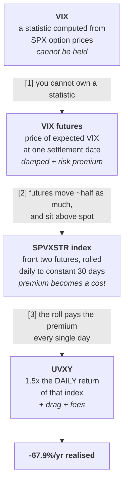

# VIX measures volatility. UVXY manufactures it.

The two are separated by four transformations, and every one of them is a
wedge. Getting this straight matters because almost every wrong intuition
about UVXY — "it should track VIX", "it must mean-revert", "a 30% VIX spike
means +45%" — comes from collapsing four things into one.



Measured end to end: `vix_lab/manufacture.py`.

---

## Layer 0 — What VIX actually measures

VIX is **not** a price, not an average of anything, and not a forecast of
direction. It is a *model-free* estimate of the market's implied variance,
read off SPX option prices:

$$\sigma^2 = \frac{2e^{rT}}{T}\sum_i \frac{\Delta K_i}{K_i^2}Q(K_i) \;-\; \frac{1}{T}\left(\frac{F}{K_0}-1\right)^2$$

Four properties follow, and each one causes a downstream problem:

| property | consequence |
|---|---|
| It is a **variance** calculation, reported as its square root | Moves are not linear in anything you trade |
| It is **constant 30-day**, interpolated between two option expiries | The maturity it refers to never arrives — it is always 30 days away |
| It is quoted in **annualised percentage points** | "VIX 18 → 20" is +2 *points* and +11% *relative*; neither is a return |
| It is a **statistic recomputed every 15 seconds**, not a position | There is nothing to buy |

That last one is the whole problem. A variance swap can replicate the
variance; nothing replicates a *constant-maturity square root of* variance.
The moment you want exposure, you must move to layer 1 — and you have
already left VIX behind.

**VIX is a thermometer reading. UVXY is a machine built to sell you the
reading, and the machine has running costs.**

---

## Layer [1] → [2] — Futures are damped, and they cost a premium

What you can actually hold is a VIX future: the price of **expected VIX at
one specific settlement date**, not today's VIX. Two things follow.

**Damping.** VIX mean-reverts, so a spike today is not expected to survive to
a distant settlement. Distant contracts barely reprice. Measured over 40
sessions on real CFE contracts:

| contract | daily sd | annualised |
|---|---:|---:|
| Aug-26 (front) | 0.0293 | 0.47 |
| Dec-26 (5th) | 0.0090 | 0.14 |
| **ratio** | **3.25×** | |

The front month moves **3.25×** the fifth month, and spot VIX moves more than
either. **A "30% VIX spike" is never a 30% move in anything you can own.**

**The premium.** Selling volatility insurance is a risk transfer, and the
seller is paid for it, so futures sit *above* where spot is expected to be.
The curve as of the 2026-08-04 close:

| settles | days out | price | vs front |
|---|---:|---:|---:|
| 2026-08-19 | 15 | 18.00 | — |
| 2026-09-16 | 43 | 19.20 | +1.20 |
| 2026-10-21 | 78 | 20.20 | +2.20 |
| 2026-11-18 | 106 | 20.65 | +2.65 |
| 2026-12-16 | 134 | 20.70 | +2.70 |

Upward sloping — **contango**. This is the normal state, roughly 80% of the
time. It is a risk premium, not a prediction that volatility will rise.

---

## Layer [2] → [3] — The daily roll turns the premium into a bill

The index UVXY tracks (S&P 500 VIX Short-Term Futures, SPVXSTR) holds the
front two contracts and **rolls a slice every single day** to keep a constant
30-day weighted maturity. Today that is 46% August + 54% September, a blended
level of 18.64.

Rolling means: sell the cheaper near contract, buy the dearer far one. Every
day. From today's actual slope:

| | |
|---|---:|
| slope, front → second | +0.0429 points/day |
| constant-30-day level | 18.64 |
| **daily roll drag** | **−0.230%/day** |
| compounded over a year | **−44.0%** |
| the same at 1.5× | **−58.1%** |

**Nothing has to happen to volatility for that to be paid.** It is paid on a
day when VIX does not move at all. This is the single most important fact
about the instrument, and it is invisible in a price chart of VIX.

When the curve inverts — backwardation, during a real panic — the sign flips
and the roll *pays*. That is the ~20% of the time UVXY makes money, and it is
why the instrument exists.

---

## Layer [3] → [4] — Leverage on the daily return, not on the period

UVXY delivers **1.5× the daily return** of that index. Measured against VIXY
(the 1× fund on the same index):

- daily-return beta **1.4915**, correlation **0.99879**

The 1.5× is essentially exact — **daily**. Over any longer window it is not
1.5× anything:

| window | UVXY | VIXY | "1.5 × VIXY" | gap |
|---|---:|---:|---:|---:|
| full sample | −99.7% | −95.7% | −143.5% | **+43.9%** |
| 2022 | −41.6% | −22.2% | −33.2% | −8.4% |
| 2023 | −87.6% | −72.6% | −108.9% | +21.3% |
| 2024 | −50.8% | −27.4% | −41.2% | −9.6% |
| 2025 | −66.5% | −44.2% | −66.3% | −0.2% |

The gap swings **±20 points a year** in both directions. Daily rebalancing
de-levers into declines (which *helps* over a long fall) and re-levers into
rallies (which hurts in a chop). The "1.5×" in the name describes one day and
nothing longer.

### The full decay, accounted for

Over 2021-08 → 2026-07 (4.99 years), composing in log space:

| component | |
|---|---:|
| 1.5 × VIXY's log decay | −61.1% |
| variance drag, 0.375·σ² (σ = 0.70) | −18.4% |
| extra expense ratio vs VIXY | −0.1% |
| **predicted UVXY CAGR** | **−67.8%** |
| **actual UVXY CAGR** | **−67.9%** |
| unexplained | **−0.1%** |

**UVXY's entire 68%/yr decay is accounted for by roll + leverage + rebalancing
drag + fees, with 0.1% left over.** None of it is a view on volatility. The
variance-drag term is the standard leveraged-ETF result: a *k*× daily fund
gives up ½·*k*·(*k*−1)·σ² per unit time, which at *k* = 1.5 is 0.375σ², and at
σ = 0.70 that alone is 18 points a year.

---

## What this adds up to

| | VIX | UVXY |
|---|---|---|
| **What it is** | a statistic | a fund |
| **Units** | annualised vol points | dollars per share |
| **Maturity** | constant 30 days, never arrives | constant 30 days, rolled daily at a cost |
| **Can you hold it** | no | yes |
| **Drift** | mean-reverting, no trend | **−67.9%/yr** |
| **Daily vol** | — | **105% annualised** (SPY: 17%) |
| **Beta to SPY** | — | **−4.62**, and 1.44× steeper on down days |

A 1.5× fund, on a 1× index, that is a damped derivative of a mean-reverting
statistic, ends up at **6× the S&P's volatility** — while the leverage the
ticker advertises is 1.5×. **That factor is the smallest of the multipliers
involved, and the only one disclosed in the fund's name.**

### Why this settles the earlier questions

- **Why it can't mean-revert usefully** (`DRIVERS.md` §1): there is no level to
  revert *to*. VIX mean-reverts; UVXY is VIX exposure minus a compounding
  bill, so its price ratchets permanently downward through reverse splits.
  Volatility mean-reverts, the price does not.
- **Why it failed the strategy** (`UVXY_EVALUATION.md`): a long-only intraday
  sleeve pays −25.1 bp/day of the roll during the session, which is layer [3]
  arriving continuously rather than overnight.
- **Why there is no symmetric short-vol product**: SVXY is −0.5× and SVIX −1×,
  because a −1.5× or −2× short-vol fund is uninsurable — the 2018-02-05
  session that destroyed XIV was a single day. The asymmetry is structural,
  not an oversight.

---

## Caveats

- **Spot VIX is not measured here.** IBKR returns "Details currently
  unavailable" for the index (conid 13455763), and the environment's proxy
  denies both `cdn.cboe.com` and FRED. Layer 0 is described from the published
  CBOE methodology; layers [2]–[4] are measured from real CFE futures and the
  fund series. The spot→futures pass-through table in `manufacture.py` is
  explicitly labelled as assumed, not measured.
- **The curve is one day's snapshot** (2026-08-04). The −44%/yr roll figure is
  what *today's* slope implies if held, not a historical average. The
  historical realisation is the VIXY CAGR of −46.8%, which is the same order
  and is measured.
- **The 80%-contango figure is from the literature, not computed here.** What
  is computed is the realised decay, which requires no such claim.

---

## Reproducing

```bash
python3 vix_lab/fetch_refs.py     # freeze the IBKR daily reference series
python3 vix_lab/manufacture.py    # every table above
```
